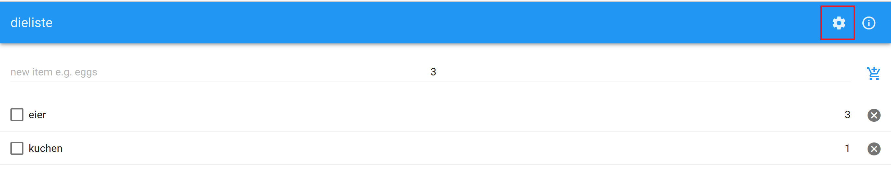
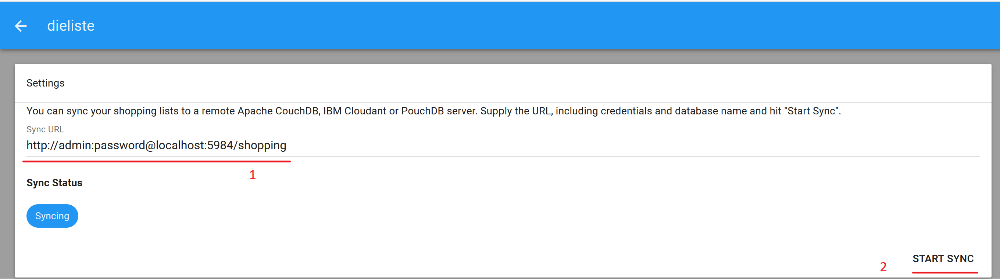

# 10.5.1 Mobile Dienste "Verteilte Applikation" - dieliste

### Beschreibung

Unsere Applikation beinhaltet eine Shopping-Liste, die Einkaufsartikel von Benutzern verwaltet und darstellt. Die Benutzer können Artikel hinzufügen, bearbeiten, löschen und sortieren lassen. Die Einkaufsliste ist über mehrere Geräte zugänglich, sodass mehrere Benutzer darauf zugreifen können. Diese Liste soll zu einem Zeitpunkt synchronisiert werden, sodass jeder Benutzer, der Zugriff hat, über die gleiche Version der Liste verfügt. Diese Liste ist auch offline zugänglich.

### Authors

Martin Howecker - Teamleiter

Nimy Abraham - Teammitglied

Nahi Islam Jashim - Teammitglied

### Unsere Applikation

[Dokumentation](https://www.overleaf.com/read/nmvhjrtfgtkh)


### Run the Application

Den Code herunterladen:
```bash
git clone https://github.com/TGM-HIT/syt5-gek1051-mobile-application-dieliste/ dieliste
cd dieliste
```

Die notwendigen npm-Pakete installieren:
```bash
# make sure you are in the root-folder of the cloned repo
npm install
```

Die App starten:
```
npm start
```

Die App ist nun unter `localhost:8081` erreichbar.


### Synchronisation

Z.B. mit CouchDB - Instanz

```bash
docker run -e COUCHDB_USER=admin -e COUCHDB_PASSWORD=password -p 5984:5984 -d couchdb
```
Oder über docker-compose
```bash
docker-compose up -d
```
Herunterfahren der CouchDB Instanz:
```bash
docker-compose down
```

Setup unter http://localhost:5984/_utils/
Single-Node-Setup auswählen

In der App Auf das Zahnrad drücken:


Entsprechende URL eingeben und auf "start sync" drücken:


### Testing

Die Umsetzung von E2E Test mit Cypress wurde begonnen. Der aktuelle Stand ist auf dem Branch *e2e_test* bis die Test-Cases vollends ausformuliert sind. 